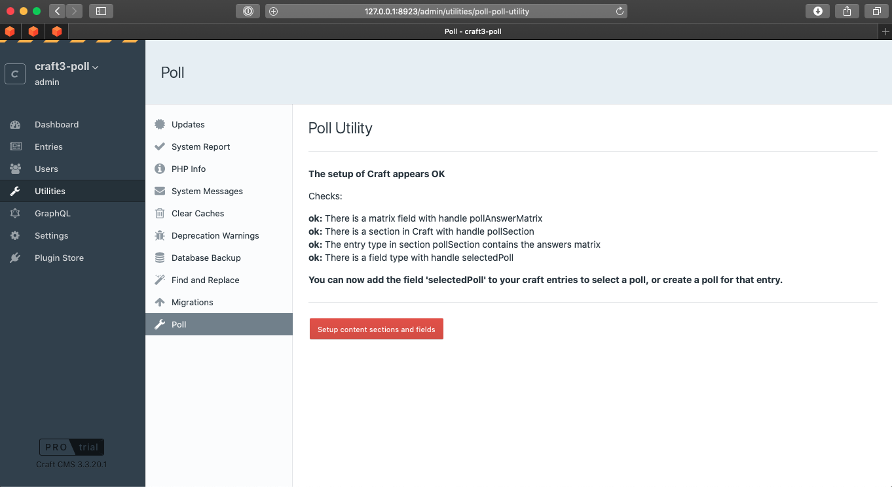

# Poll plugin for Craft CMS 3.x

**For installation and usage please read the docs at [io.24hoursmedia.com](https://io.24hoursmedia.com/craftcms-poll)**

## Requirements

This plugin requires Craft CMS 3.0.0 or later.
PHP >= 7.2

## Installation

Download and install poll in the Craft CMS plugin store, or:

Composer:

    composer require twentyfourhoursmedia/poll

## Post-installation setup

After the plugin has been installed and activated, further setup is required to install the default field types,
sections etc.

You can go to the poll utility section to install these and verify the status.

See the set up section of the [poll's documentation](https://io.24hoursmedia.com/craftcms-poll/setup).

## Usage

After installation and setup, you can create new polls in the poll section.

You can add the 'selectPoll' field to your content entries to attach a poll.
The example application contains an example to show the poll and results with ajax too.

## Roadmap

See: https://io.24hoursmedia.com/craftcms-poll/roadmap

---

Brought to you by [24hoursmedia](https://www.24hoursmedia.com)

Logo by https://www.iconfinder.com/ReactiveDoodlesApp
